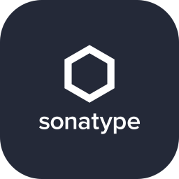
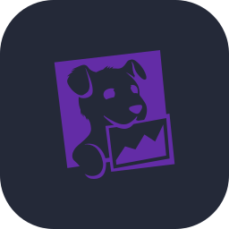

# Lautaro Ponzo

**Senior Full Stack Developer** · React · React Native · TypeScript · Java + Spring Boot · Node.js 
Buenos Aires, Argentina · Remote

Full Stack Developer with 7 years of experience building web and mobile products. Strong foundation in frontend and mobile with React, React Native and TypeScript, and backend experience with Java and Spring Boot in fintech and with Node.js and NestJS at startups.

Fintech (micro-loans, P2P transfers, third-party payments, biometric validation) and healthcare products, plus code review, onboarding and technical assessment of candidates.

## Experience

- **Conexa** · Senior Mobile Developer · 2025 – Present 
  React Native for Intramed (social network for doctors) and Santander Peru's digital wallet (Pomelo integration).
- **GlobalLogic** · Full Stack Developer · 2023 – 2025 
  Claro Pay: Java 21 + Spring Boot micro-loans backend, biometric validation with Equifax, OpenShift + Jenkins, React Native investments module, micro-frontends admin portal.
- **Superior Digital** · Senior Full Stack Developer · 2023 
  Node.js / NestJS / Prisma APIs, real-time chat with Socket.io, AWS deployments (Elastic Beanstalk, S3, API Gateway).
- **Spartan Elite Rugby** · React Native Developer (Freelance) · 2021 – 2022
- **Proveat** · Junior Frontend Developer · 2019 – 2021

## Stack

<table>
  <tr>
    <td align="center" width="88"> TypeScript</td>
    <td align="center" width="88"> JavaScript</td>
    <td align="center" width="88"> React</td>
    <td align="center" width="88"> React Native</td>
    <td align="center" width="88"> Next.js</td>
    <td align="center" width="88"> Redux</td>
    <td align="center" width="88"> Tailwind CSS</td>
    <td align="center" width="88"> Expo</td>
    <td align="center" width="88"> Node.js</td>
  </tr>
  <tr>
    <td align="center" width="88"> NestJS</td>
    <td align="center" width="88"> Express</td>
    <td align="center" width="88"> Java</td>
    <td align="center" width="88"> Spring Boot</td>
    <td align="center" width="88"> Maven</td>
    <td align="center" width="88"> Socket.io</td>
    <td align="center" width="88"> Prisma</td>
    <td align="center" width="88"> MongoDB</td>
    <td align="center" width="88"> PostgreSQL</td>
  </tr>
  <tr>
    <td align="center" width="88"> Docker</td>
    <td align="center" width="88"> Kubernetes</td>
    <td align="center" width="88"> OpenShift</td>
    <td align="center" width="88"> Jenkins</td>
    <td align="center" width="88"> Nexus</td>
    <td align="center" width="88"> AWS</td>
    <td align="center" width="88"> Firebase</td>
    <td align="center" width="88"> Swift</td>
    <td align="center" width="88"> Kotlin</td>
  </tr>
  <tr>
    <td align="center" width="88"> Jest</td>
    <td align="center" width="88"> SonarQube</td>
    <td align="center" width="88"> Sentry</td>
    <td align="center" width="88"> Datadog</td>
    <td align="center" width="88"> Webpack</td>
    <td align="center" width="88"> Nginx</td>
    <td align="center" width="88"> Git</td>
  </tr>
</table>

**Also:** Webpack Module Federation · Micro-frontends · NativeWind · EAS · Mockito · Veracode · AWS Amplify

## Featured projects

| Project | Stack |
|---|---|
| [Task Manager — Backend](https://github.com/najlepzy/LemonCashBE) | NestJS · PostgreSQL · Prisma · JWT · Zod |
| [Task Manager — Frontend](https://github.com/najlepzy/LemonCashFE) | React · TypeScript · real-time Kanban |
| [Conexa challenge](https://github.com/najlepzy/Conexa-challenge-FE) | React Native · Expo |
| [Digs calendar](https://github.com/najlepzy/Digs-challenge) | React Native · iOS & Android |
| [Ecommerce backend](https://github.com/najlepzy/EcommerceBackend) | Node.js · Express · MongoDB |

## Contact

[LinkedIn](https://www.linkedin.com/in/lautaroponzo) · lautanaj@hotmail.com
